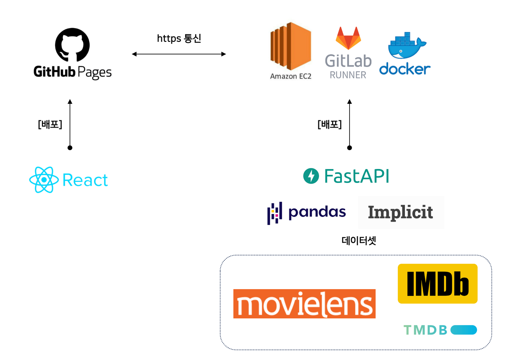

[프로젝트]
영화 추천 서비스 배포

[웹 주소]
https://passiona2z.github.io/recommendation-project
- __유료 과금(Amazon EC2)으로 백엔드 서버를 중지한 상태__

[이력]
230718 : (서버 - 프론트 연동) 서비스 페이지 정상 작동 확인

[목적]
- 추천 서비스 Work flow 파악(백엔드 → 프론트엔드)

[스터디]
- 서버 인프라 : API 서버 구축
    - AWS EC2
        - GitLab CI/CD
        - Docker
- 애플리케이션 : React

[웹 서비스 구조도]

[웹 서비스 기능]
- 유저 기반 협업필터링(추천)
- 랜덤(무작위) 추천
- 장르별 추천
- 영화 설명 텍스트 활용 : 아이템 기반 협업필터링(추천)

[기본 툴]
- 가상환경 : venv 활용
- DevOps : gitlab 활용
- Dataset : movielens 데이터셋 
    - IMDB : 영화정보 url
    - TMDB : API 기반 포스터 이미지 크롤링
- 추천시스템 라이브러리 : implicit (for implicit data)

[백엔드]
- API 구성 : fastAPI
- 서버 : Amazon EC2
- CI/CD : gitlab runner, docker

[프론트]
- 웹앱 : React
- 웹 페이지 : github pages,
- 배포 : yarn

[참고자료]
- https://product.kyobobook.co.kr/detail/S000200398450
- https://www.youtube.com/watch?v=V48d4qJiV4U&ab_channel=%ED%83%80%EB%AA%A8%EB%94%94%EC%9E%90%EC%9D%B8TAMO
- https://grouplens.org/datasets/movielens
- https://github.com/benfred/implicit
- https://wikidocs.net/175092
- https://yoonsu.tistory.com/26
- https://www.youtube.com/watch?v=0Emq5FypiMM&ab_channel=%EB%93%9C%EB%A6%BC%EC%BD%94%EB%94%A9
- https://www.heropy.dev/p/ijqX9h